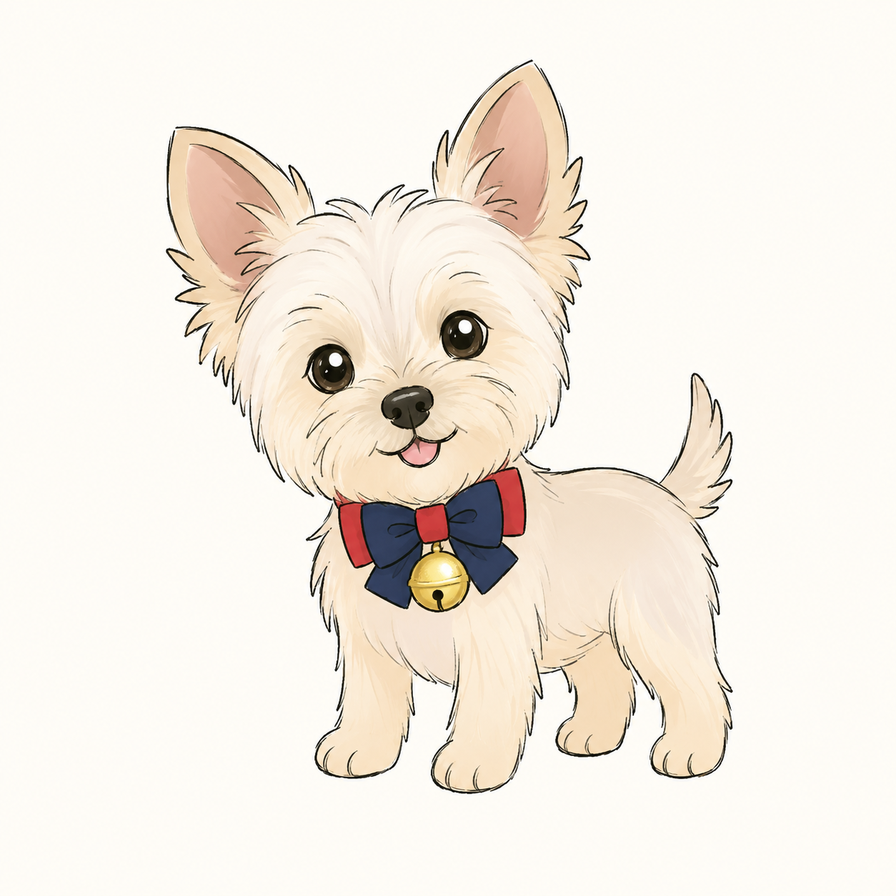

# Cookie 桌宠 🐾

让手绘 Cookie 在 macOS 桌面上散步、发呆、看你和睡觉。它是透明无边框的原生桌宠，不是网页，也不需要一直开着 Terminal。

<p align="center"></p>

> 支持 Apple Silicon / Intel Mac，macOS 13+。首次安装需要联网下载 PyObjC（如果你的 Python 尚未安装它）。

## 最快开始

1. 点击 GitHub 页面右上角 **Code → Download ZIP**，解压。
2. 双击 `启动Cookie.command`。
3. 如果 macOS 阻止第一次打开：右键该文件 → **打开** → 再确认打开。

启动器会把运行副本放在 `~/Library/Application Support/CookieDesktopPet/`，安装用户级 LaunchAgent，并在以后登录时自动回来。项目文件夹之后可以移动。

如果提示没有 Python 3，请先安装 [Python 3](https://www.python.org/downloads/macos/) 或 Homebrew Python，再双击一次。

## 怎么玩

- 单击 Cookie：摸摸她。
- 双击 Cookie：站起来作揖。
- 拖拽：放到喜欢的位置，下次会记住。
- 右键：退出本次运行；不会自动重开，下次登录或再次双击启动器才回来。
- `停止Cookie.command`：停止桌宠但保留安装。
- `卸载Cookie.command`：停止并把程序与状态移到废纸篓（可恢复）。

## 她会做什么

- 在当前显示器底部散步，走到边缘会压低身体、转向再继续。
- 发呆时呼吸、摇尾巴，偶尔向左或向右看。
- 连续 45 秒没有鼠标移动就睡觉；鼠标回来会醒。
- 只读取当前鼠标坐标来判断“有没有动”，不记录轨迹、不监听键盘或点击内容。
- 使用 190×214 的预缩放透明图层和 24 fps 渲染，适合小尺寸常驻。

## 从源图重新生成桌宠素材

仓库保留了完整图片流水线：

```text
source_images/          四种 1254×1254 近白底源图
  idle.jpg / idle.png   站立正面；JPG 是四肢切件母图，PNG 是状态母图
  stand.png             作揖
  down.png              趴下
  sleep.png             睡觉
tools/cut_layers.py     抠背景并切头、尾、身体、四腿、眼皮与接缝补片
tools/make_states.py    统一蝴蝶结，抠出完整状态图并对齐地面线
tools/build_compact.py  生成运行时小图
assets/                 950×1070 中间产物
assets_compact/         190×214 运行时图层
```

双击 `重新生成图片.command` 会创建隔离的 Python 环境、安装 Pillow / NumPy / SciPy，并依次执行三步。源图尺寸、构图或狗的位置发生变化时，需要同步调整 `cut_layers.py` 里的多边形、腿区和 pivot；这部分是针对 Cookie 的图手工校准的，不是任意照片的一键 AI 抠图。

命令行方式：

```bash
python3 -m venv .asset-venv
.asset-venv/bin/pip install -r requirements-assets.txt
.asset-venv/bin/python tools/cut_layers.py
.asset-venv/bin/python tools/make_states.py
.asset-venv/bin/python tools/build_compact.py
```

## 开发与验收

```bash
python3 -m py_compile cookie_pet.py tools/*.py
./启动Cookie.command
launchctl print "gui/$(id -u)/com.aque.cookie-desktop-pet"
```

主程序是 `cookie_pet.py`，使用 PyObjC / AppKit。运行状态保存在：

- 位置与朝向：`~/.cookie_desktop_pet_state.json`
- 单例锁：`~/.cookie_desktop_pet.lock`
- PID：`~/.cookie_desktop_pet.pid`
- 日志：`~/Library/Logs/CookieDesktopPet.*.log`

## 授权

代码采用 MIT License。Cookie 的源照片及衍生图片仅授权个人、非商业桌宠使用，详见 [LICENSE](LICENSE)。
